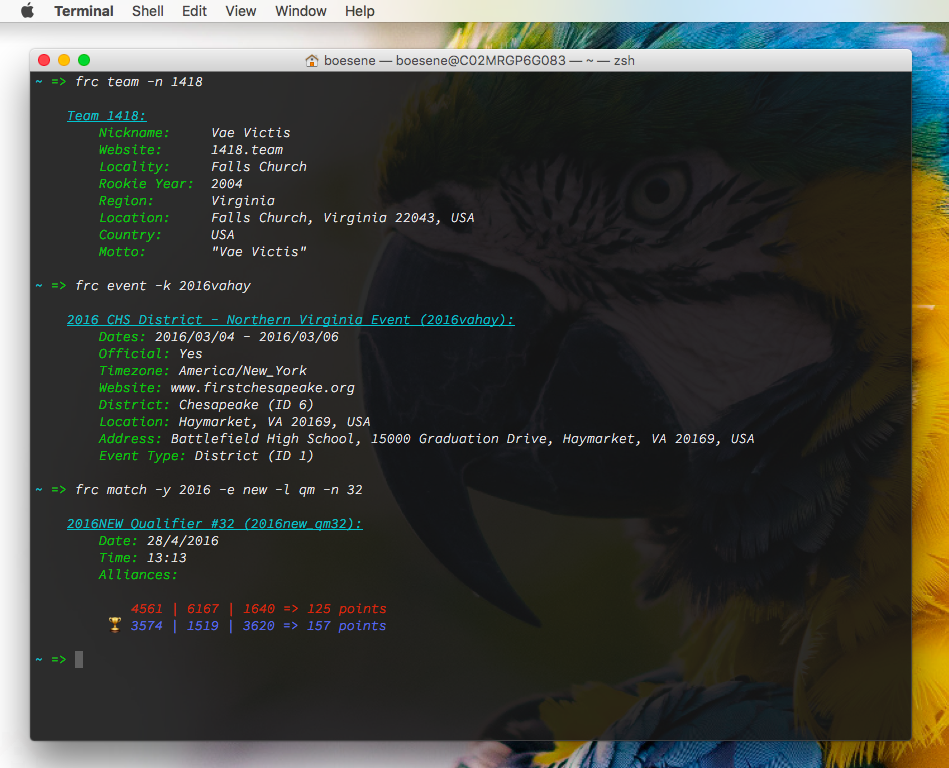

# `./frc`
A helpful CLI app for FRC-related tasks.

* Fetch data from The Blue Alliance
* More features coming soon



## Compiling
* Clone the repository and `cd` into it
* Build the executable:

```bash
go build frc.go
```

* Move it so that it can be executed from anywhere (choose another location in your path if you don't have administrator privileges):

```bash
mv frc /usr/local/bin/frc
```

## Usage examples
* Get all data on a team:

```bash
frc team -n 254
```

* Get a specific data point about a team:

```bash
frc team -n 2056 -d country # => Team 2056 is from Canada.
```

* Get data on an event:

```bash
frc event -k 2013cmp
```

(If you omit the year, the current year will be inferred.)

* Get a specific data point about an event:

```bash
frc event -k new -d official # => The Newton Division is an official FIRST event.
```

* To get match data, there are two methods; by key

```bash
frc match -k 2017mokc_qm23
```

or by identifiers.

```bash
frc match -y 2017 -e mokc -l qm -n 23
```

## Licensing
This software is available under the terms of the [BSD License](LICENSE).

## Authors
* [Erik Boesen](https://github.com/ErikBoesen)
