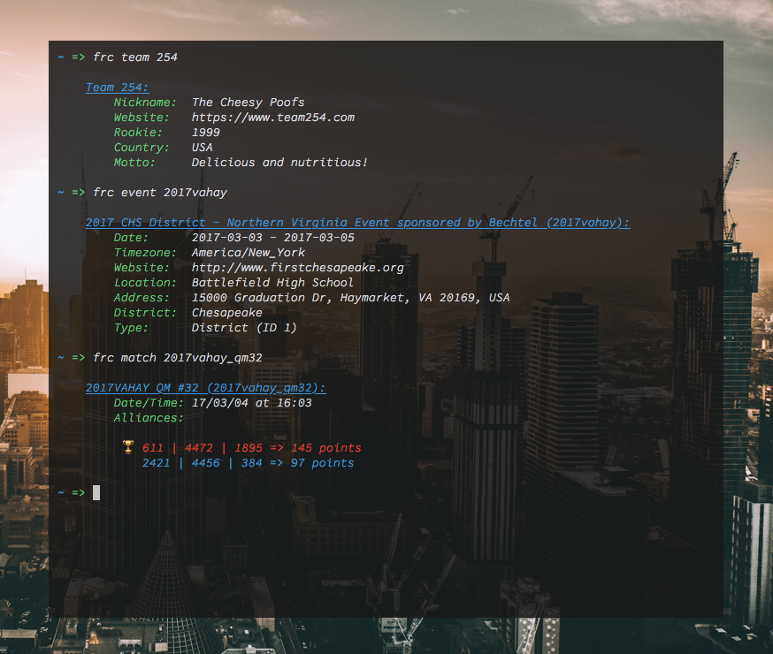

# `./frc`
A helpful CLI app for FRC-related tasks including fetching data on teams, events, matches, etc.



## Compiling
* Clone the repository and `cd` into it
* Install with
```sh
go install
```
You may need to set your `$GOBIN` environment variable first.

## Usage examples
* Get all data on a team:

```sh
frc team 254
```

* Get data on an event (If you omit the year, the current year will be inferred.):

```sh
frc event 2013cmp
```

* To get match data:

```sh
frc match 2017mokc_qm23
```

## Licensing
This software is available under the terms of the [BSD License](LICENSE).

## Authors
* [Erik Boesen](https://github.com/ErikBoesen)
